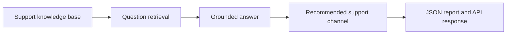

# Student Support Copilot

## PT-BR

### Visão rápida
Este projeto mostra como construir um **copiloto de suporte ao estudante com RAG**. O sistema responde perguntas operacionais e acadêmicas usando uma base local de FAQ, calendário, políticas e processos de suporte, sempre com grounding, fontes e sugestão de canal adequado.

### Por que isso faz sentido em EdTech
Grande parte das dúvidas de estudantes gira em torno de:
- prazos;
- plataforma;
- office hours;
- entregas;
- integridade acadêmica;
- acomodações e suporte institucional.

Um copiloto útil precisa não só responder, mas também:
- recuperar a política correta;
- sugerir o canal certo;
- deixar claro o limite da resposta.

### O que o projeto faz
1. Gera um corpus local de suporte acadêmico.
2. Recupera os melhores trechos para a pergunta.
3. Monta uma resposta grounded.
4. Sugere o canal correto de atendimento.
5. Exporta um relatório estruturado em `JSON`.
6. Expõe uma `FastAPI` simples para integração com produto.

### Arquitetura conceitual


### Estrutura do repositório
- [src/sample_data.py](/Users/flaviagaia/Documents/CV_FLAVIA_CODEX/-student-support-copilot/src/sample_data.py)
  Gera o corpus local de suporte.
- [src/retrieval.py](/Users/flaviagaia/Documents/CV_FLAVIA_CODEX/-student-support-copilot/src/retrieval.py)
  Faz o retrieval lexical com `TF-IDF + cosine similarity`.
- [src/generation.py](/Users/flaviagaia/Documents/CV_FLAVIA_CODEX/-student-support-copilot/src/generation.py)
  Constrói a resposta grounded e define o `recommended_channel`.
- [src/pipeline.py](/Users/flaviagaia/Documents/CV_FLAVIA_CODEX/-student-support-copilot/src/pipeline.py)
  Orquestra o run ponta a ponta.
- [app.py](/Users/flaviagaia/Documents/CV_FLAVIA_CODEX/-student-support-copilot/app.py)
  Expõe a API do copiloto.
- [tests/test_project.py](/Users/flaviagaia/Documents/CV_FLAVIA_CODEX/-student-support-copilot/tests/test_project.py)
  Valida o contrato mínimo do projeto.

### Base de conhecimento
O corpus local cobre:
- late work;
- exam schedule;
- accommodation policy;
- technical support process;
- office hours;
- academic integrity;
- project submission guide;
- discussion board guidelines.

### Técnicas utilizadas
#### 1. Retrieval reproduzível
O projeto usa `TF-IDF + cosine similarity` como baseline lexical determinístico.

Isso ajuda porque:
- é simples de testar;
- facilita debugging;
- deixa a lógica de recuperação explícita;
- serve como base forte antes de embeddings.

#### 2. Grounded response
A resposta é construída usando o documento mais relevante e, quando útil, uma fonte secundária.

Isso demonstra:
- grounding;
- rastreabilidade;
- resposta com contexto real;
- redução de hallucination.

#### 3. Encaminhamento operacional
O copiloto não só responde. Ele também sugere um canal:
- `discussion_board`
- `student_services`
- `support_ticket`
- `private_instructor_contact`

Isso aproxima o projeto de um cenário real de support automation.

### Contrato de saída
O pipeline gera:
- [student_support_copilot_report.json](/Users/flaviagaia/Documents/CV_FLAVIA_CODEX/-student-support-copilot/data/processed/student_support_copilot_report.json)

Campos principais:
- `question`
- `answer`
- `recommended_channel`
- `confidence`
- `sources`
- `limitation_note`

### Resultado atual
- `dataset_source = student_support_local_sample`
- `document_count = 8`
- `top_source = SUP-1004`
- `top_similarity = 0.4205`
- `recommended_channel = support_ticket`
- `confidence = 0.7989`

### Como executar
```bash
python3 main.py
python3 -m unittest discover -s tests -v
```

### Como rodar a API
```bash
uvicorn app:app --reload
```

Endpoints:
- `GET /health`
- `POST /support`

Exemplo:
```json
{
  "question": "What should I do if the learning platform is down before a deadline?",
  "top_k": 3
}
```

### Contrato da API
`POST /support` retorna:
- `question`
- `answer`
- `recommended_channel`
- `confidence`
- `sources`
- `limitation_note`

Isso é importante porque permite integrar o copiloto com:
- help center;
- triagem automática;
- inbox de suporte;
- analytics por tipo de dúvida.

### Do básico ao avançado
No nível básico, este projeto é um pipeline de recuperação de FAQ com resposta estruturada.

No nível intermediário, ele é um **student support copilot grounded**.

No nível avançado, ele permite discutir:
- support automation em educação;
- roteamento de canal;
- grounding e política institucional;
- integração com backend;
- evolução para classificação de intenção e LangGraph.

### Como defender este projeto em entrevista
- ele mostra um caso real de suporte estudantil, não só um chatbot genérico;
- combina retrieval com decisão operacional simples;
- é alinhado a produtos educacionais de alto volume;
- ajuda a discutir RAG, API integration e readiness para produção.

### Arquitetura alvo em produção
Uma evolução natural seria:
- ingestão de políticas e FAQs institucionais;
- retrieval híbrido;
- classificação de intenção;
- integração com ticketing;
- tracing de respostas e handoff para agentes humanos.

## EN

### Quick overview
This project builds a **student support copilot with RAG**. It answers academic and operational questions using a local corpus of FAQ, policies, calendar information, and support procedures, always with grounding, citations, and a recommended support channel.

### What the project does
1. Builds a local student-support corpus.
2. Retrieves the best evidence for a question.
3. Constructs a grounded answer.
4. Suggests the appropriate support channel.
5. Exports a structured `JSON` report.
6. Exposes a simple `FastAPI` service.

### Output contract
The project exports:
- [student_support_copilot_report.json](/Users/flaviagaia/Documents/CV_FLAVIA_CODEX/-student-support-copilot/data/processed/student_support_copilot_report.json)

Main fields:
- `question`
- `answer`
- `recommended_channel`
- `confidence`
- `sources`
- `limitation_note`

### Current result
- `dataset_source = student_support_local_sample`
- `document_count = 8`
- `top_source = SUP-1004`
- `top_similarity = 0.4205`
- `recommended_channel = support_ticket`
- `confidence = 0.7989`

### Run locally
```bash
python3 main.py
python3 -m unittest discover -s tests -v
```

### API
```bash
uvicorn app:app --reload
```

### Advanced discussion points
This repository is useful to discuss:
- grounded support automation;
- routing and escalation logic;
- education-focused RAG;
- integration of retrieval and operational response handling.

### Production-facing interpretation
This MVP already separates:
- knowledge base;
- retrieval;
- grounded response logic;
- routing recommendation;
- API exposure.

That makes it easier to evolve the feature into a real student-support workflow.
